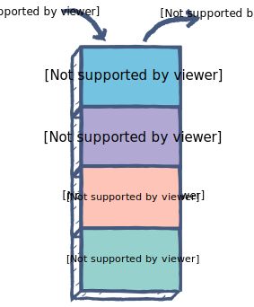
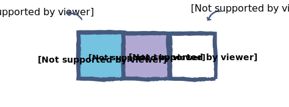
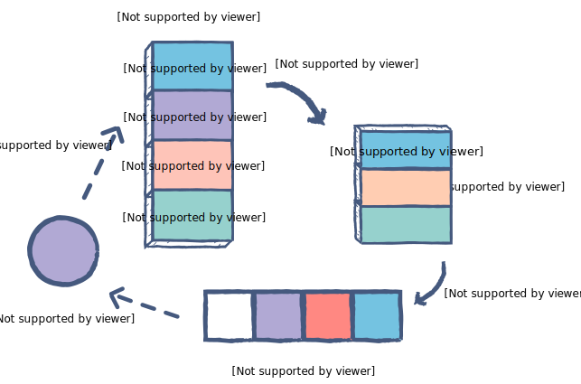

# Rangkuman
* [Closure](#closure) 
* [Immediately Invoked Function Expression](#iife)
* [First-class function](#first-class-function)
* [Higher-order function](#higher-order-function)
* [Execution Context](#execution-context)
* [Execution Context Stack](#execution-context-stack)
* [Event Loop](#event-loop)
* [Callbacks](#callbacks)
* [Promises dan Async/Await](#promises-and-async-or-await)
* [Reference](#reference)


## Closure
Closure adalah bentuk eksekusi sebuah function oleh function lainnya.
* [go to file Closure.js](Closure.js)
```javascript
function makeFunc() {
    const name = '<<   CLOSURE   >>';
    function displayName() {
        console.log(name);
        console.log("source : https://developer.mozilla.org/en-US/docs/Web/JavaScript/Closures");
    }
    return displayName;
}

    const myFunc = makeFunc();
    myFunc();

```


## IIFE
Immediately Invoked Function Expression atau IIFE adalah sebuah function dimana sebuah variabel dalam function hanya dapat diakses di dalam functionnya, berikut contoh pertama dari Ben Alman.
* [go to file IIFE.js](IIFE.js)

```javascript
console.log("<<   IIFE   >>");
function countingNum() {
        // variabel i hanya dapat diakses di dalam countingNum.
        var i = 0;
        return function() {
        console.log( ++i );
        };
    }
    // Sehingga variabel counter dan counter 2 memiliki scope nya masing-masing.
    
    var counter = countingNum();
    var counter2 = countingNum();
    counter(); // logs: 1
    counter(); // logs: 2
    counter2(); // logs: 1
    counter2(); // logs: 2
    try {
        i; // ReferenceError: i is not defined at IIFE.js:20:21
    } catch (error) { // artinya i tidak dapat diakses secara langsung
        console.log(error);
    }
    ...
```

## First-Class-Function
First-Class Funtion adalah keadaan dimana function dapat ditugaskan ke variabel lain atau diteruskan sebagai argumen atau dapat dikembalikan oleh fungsi lain.
* [go to file FirstClass-Function.js](FirstClass-Function.js)
```javascript
console.log("<<  First-Class Function  >>");

const nama = (a, b) => {
    return (a + " " + b);
}

console.log(nama("Adi", "Sulaksono"));
```

## Higher-Order-Function
High-Order Function adalah function yang menggunakan function lain sebagai argumen atau mengembalikan function.
* [go to file HighOrder-Function.js](HighOrder-Function.js)
```javascript
// Contoh 1 Assign function ke variabel
console.log("<<  High-Order Function  >>");

const hiFunction = () => { 
    console.log('Hello World');
};

hiFunction();
```

## Execution-Context
Execution Context (EC) adalah bentuk pendefinisian dalam javascript terkait pada environment mana sebuah code akan dieksekusi atau dapat diakses pada waktu tertentu
Dalam EC dikenal dua tipe, pertama Global Execution Context atau (GEC) dan kedua adalah Functional Execution COntext (FEC). 
* [go to file EC.js](EC.js)
```javascript
console.log("<<   Execution Context   >>"); //ini dapat disebut GEC karena akan dieksekusi pertama saat mulai di run

const firstFunction = () =>{
    console.log("First Function Executed");
    const secondFunction = () =>{
        console.log("Second Function Executed");
    }
    secondFunction(); // selanjutnya secondFunction(); merupakan FEC karena eksekusi nya yang membutuhkan function 
}
firstFunction(); //firstFunction(); juga merupakan contoh FEC
```

## Execution-Context-Stack
Execution Context Stack (ECS) merupakan sebuah stack data dalam js dengan konsep LIFO untuk menyimpan semua stack proses eksekusi.
* [go to file ECS.js](ECS.js)
<p align="center">
    
</p>

```javascript
console.log("<<   Execution Context Stack   >>"); //Global Execution Stack atau akan berada di stack paling bawah

const firstFunction = () =>{
    console.log("First Function Executed");
    const secondFunction = () =>{
        console.log("Second Function Executed");
    }
    secondFunction(); // secondFunction(); akan berada pada posisi stack paling akhir  
}
firstFunction(); // firstFunction(); berada pada stack proses setelah Global Execution Stack
```

## Event-Loop
Event Loop adalah bentuk cara kerja js terutama dalam hal asynchronus nya dengan menjalankan eksekusi dalam single thread, namun menggunakan beberapa struktur data yang membuatnya seakan seperti multi-threading
* [go to file Event-Loop.js](Event-Loop.js)

<p align="center" style="display:flex; align-items:center;">
    Stack berperan untuk menjaga track dari semua operation yang akan dieksekusi, jika sebuah function selesai maka akan di pop() dari stack.
    &nbsp;&nbsp;&nbsp;&nbsp;
    
</p>
<br/>
<p align="center" style="display:flex; align-items:center;">
    
    Event queue bertugas untuk mengirim functions baru ke stack agar diproses.
</p>
<br/>
<p align="center" style="display:flex; align-items:center;">
    
    &nbsp;
    Berikut contoh skema keseluruhannya, contoh tersebut merupakan penggunaan setTimeout()
</p>

```javascript
const seconds = new Date().getTime() / 1000;
console.log(seconds);//langsung dieksekusi
setTimeout(() => {
    //Print out 2,000.... artinya callback tidak langsung terpanggil sebelum 1 seconds
    console.log(`Berjalan setelah ${new Date().getTime() / 1000 - seconds} seconds`);
}, 1000)

while (true) {
    if (new Date().getTime() / 1000 - seconds >= 2) {
    console.log("Loop terjadi dalam 2 seconds");
    break;
    }
}
```

## Callbacks
Callbacks adalah sebuah function yang dikirim sebagai argumen ke function lain dan juga memungkinkan function memanggil function lainnya. Umumnya dalam synchronus jarang digunakan, namun akan sangat dibutuhkan dalam async karena dapat membuat function menunggu funtion lainnya dieksekusi
* [go to file Callbacks.js](Callbacks.js)

```javascript
//contoh dalam bentuk synchronus
function textDisplay(text) {
    console.log(text);
  }
  
  function myCalculator(a, b, myCallback) {
    let add = a + " " + b;
    myCallback(add);
  }
  
  myCalculator("Adi", "Sulaksono", textDisplay);
```

## Promises-and-Async-or-Await
Promise adalah dasar dari asynchronus di javascript berupa pengembalian objek digunakan untuk menghandle async operation sehingga ketika berurusan dengan multiple async operation dapat dengan mudah di manage.
* [go to file PAA.js](PAA.js)

Contoh simple promise
```javascript
const promised= new Promise((resolve, reject) => {
    setTimeout(() => {
        resolve ("Done")
        reject ("Didn't")
    }, 2000);
});


promised.then((result) => {
    console.log(result);
})
.catch(function(error){
    console.log(error);
});
```
- Async membuat function return ke promise
- Await membuat function menunggu promise

Contoh penggunaan Promise, Async, dan Await
```javascript
function resolveAfter2Seconds() {
    return new Promise(resolve => {
        setTimeout(() => {
            resolve('resolved');
        }, 2000);
    });
}

async function asyncCall() {
    console.log('calling');
    const result = await resolveAfter2Seconds();
    console.log(result);
}

asyncCall();

// Contoh advance dalam penggunaan fetch data dari eksternal
(async () => {
    let response = await fetch('https://mdn.github.io/learning-area/javascript/apis/fetching-data/can-store/products.json');
    let user = await response.json();
})();

await new Promise(resolve => setTimeout(resolve, 1000))
console.log('Hello!')
```


## Reference
- https://developer.mozilla.org/en-US/docs/Web/JavaScript/Closures
- https://web.archive.org/web/20171201033208/http://benalman.com/news/2010/11/immediately-invoked-function-expression/#iife 
- https://developer.mozilla.org/en-US/docs/Glossary/IIFE
- https://www.freecodecamp.org/news/execution-context-how-javascript-works-behind-the-scenes/
- https://medium.com/@happymishra66/execution-context-in-javascript-319dd72e8e2c#:~:text=Execution%20context%20(EC)%20is%20defined,to%20at%20a%20particular%20time
- https://www.educative.io/answers/what-is-an-event-loop-in-javascript
- https://developer.mozilla.org/en-US/docs/Web/JavaScript/EventLoop
- https://www.geeksforgeeks.org/what-is-the-first-class-function-in-javascript/#:~:text=First%2DClass%20Function%3A%20A%20programming,be%20returned%20by%20another%20function. 
- https://developer.mozilla.org/en-US/docs/Glossary/First-class_Function
- https://dmitripavlutin.com/javascript-higher-order-functions/
- https://www.w3schools.com/js/js_callback.asp
- https://www.w3schools.com/js/js_promise.asp
- https://www.geeksforgeeks.org/javascript-promises/
- https://www.w3schools.com/js/js_async.asp